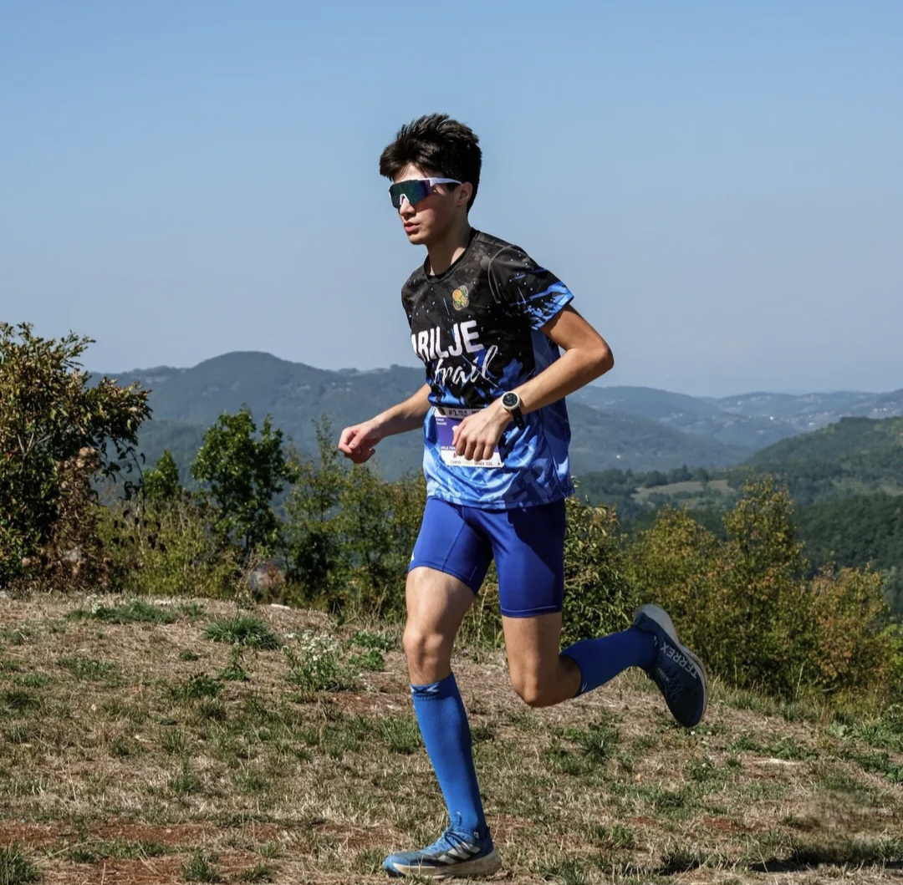

<!DOCTYPE html>
<html lang="sr">
<head>
    <meta charset="UTF-8">
    <meta name="viewport" content="width=device-width, initial-scale=1.0">
    <title>Aleksa Nenadic</title>
    
</head>
<body>
    <header>
        <h1>ALEKSA NENADIC</h1>
        
16 godina • Arilje

        <nav>
            <a href="#about">O meni</a>
            <a href="#contact">Kontakt</a>
        </nav>
    </header>

    

        

             ALEKSA NENADIC          |          II4          |          INFORMATIČKA GIMNAZIJA          |          ARILJE          |          TRČANJE          |          LOTR & HOBBIT          |          
        

    

    

        <!-- O meni sekcija -->
        <section id="about" class="section">
            <h2>O meni</h2>
            

                Učenik drugog razreda informatičke gimnazije "Sveti Sava" u Pozezi. Bavim se trčanjem i aktivno pratim kinematografiju i литературу, posebno fantastičnu.
            

        </section>

        <!-- Osnovne informacije -->
        <section class="section">
            <h2>Osnovne informacije</h2>
            

                

                    
Puno ime

                    
Aleksa Nenadic

                

                

                    
Razred

                    
II4

                

                

                    
Škola

                    
Gimnazija "Sveti Sava" - Pozega

                

                

                    
Datum rođenja

                    
29.12.2009.

                

                

                    
Godina

                    
16 godina

                

                

                    
Grad

                    
Arilje

                

            

        </section>

        <!-- Kontakt -->
        <section id="contact" class="section">
            <h2>Kontakt</h2>
            

                
Telefon

                
0677633962

            

            

                
Email

                
aleksa.nenadic.09@gmail.com

            

        </section>

        <!-- Hobi - Trčanje -->
        <section class="section">
            <h2>Moji interesi</h2>
            
            
            
            <h3 style="margin-top: 20px; margin-bottom: 15px;">Trčanje</h3>
            

                <h3>Polumaraton</h3>
                
Osobni rekord: <strong>1:30:11</strong>

            

            <h3 style="margin-top: 25px; margin-bottom: 15px;">Omiljeni žanrovi</h3>
            

                

                    <h3>🖤 Horror</h3>
                

                

                    <h3>🌌 Sci-Fi</h3>
                

                

                    <h3>⚔️ Action</h3>
                

            

            <h3 style="margin-top: 25px; margin-bottom: 15px;">Omiljene knjige i serijale</h3>
            

                

                    <h3>Gospodar Prstenova</h3>
                    
J.R.R. Tolkien

                

                

                    <h3>Hobit</h3>
                    
J.R.R. Tolkien

                

            

        </section>
    

    <footer>
        
&copy; 2026 Aleksa Nenadic | Sva prava zadržana

    </footer>
</body>
</html>
